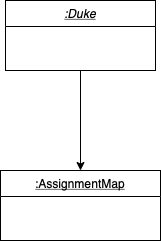
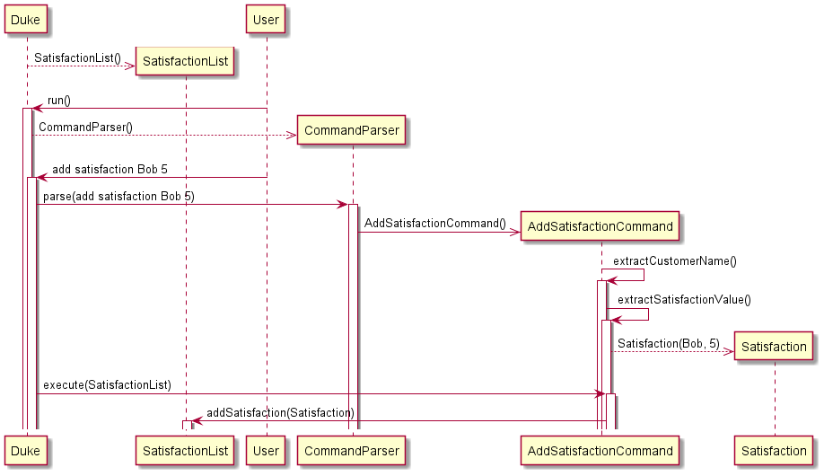

# Developer Guide

## Acknowledgements

{list here sources of all reused/adapted ideas, code, documentation, and third-party libraries -- include links to the original source as well}

## Design & implementation

#### Assign a housekeeper to a room
The assignment of housekeeper to a room is facilitated by `AssignHousekeeperCommand`. This command objects uses `AssignmentMap`, which keeps a `HashMap`, to help us map a `Room` object to a `Housekeeper` object. 

``
Map<Room, Housekeeper> map = new HashMap<>();
``

The following steps exhibit how `AssignHousekeeperCommand` 
and `AssignmentMap` fit together in the structure and how the mechanism for adding an assinment behaves at each step.

__Step 1.__ The user launches the application. In the `Duke` class, an empty instance of the `AssignmentMap` class,
called `assignmentMap`, is created.

__Step 2.__ The user types the command `Assign Susan ## 301`. In the `Duke` class, a `Command` object
is created by invoking the `CommandParser` class's constructor on the user input. The details of this
step are further described below.

__Step 3.__ The `CommandParser` class replaces the `Assign Susan ## 301` in the user input with an empty string,
leaving just `Susan ## 301`. Then, an instance of `AssignHousekeeperCommand` is created which extends `Command`.

__Step 4.__ The `assignHousekeeperCommand` object parses the name of the housekeeper and the ID of the room and send both to the the `assignmentMap`.

__Step 5.__ The `assignmentMap` looks for the appropriate `Room` object for `301` in the `RoomList` and then looks for the appropriate `Housekeeper` object for `Susan`. It then adds both to the hashmap contained inside itself.

__Interaction__ To understand the interaction between objects of these classes in order to actually add an entry into the hash map inside an `AssignmentMap`, refer to the sequence diagram below.

The command object passes on the ID of the room and the name of the housekeeper to the `AssignmentMap` object after parsing the input appropriately. The `addAssignment` function first locates the appropriate `Room` object from `RoomList`, and then looks for the `Housekeeper` object in the `HousekeeperList` and finally adds the mapping to the hash map.

#### Adding a customer's satisfaction rating

The mechanism for adding a customer satisfaction (represented by the Satisfaction class) is facilitated
by `AddSatisfactionCommand`. The constructor parses user input to create a `Satisfaction` object (which contains
attributes storing the customer's name and their satisfaction rating, represented as an integer from 1 to 5).
`AddSatisfactionCommand` extends `Command` and contains an override of the `Command` class's execute method.
This execute method adds the `Satisfaction` object created from parsing user command into `satisfactionList`, the
object of type `SatisfactionList` that stores the `Satisfaction` objects. Additionally, it implements the
following operations:
* `AddSatisfactionCommand#extractCustomerName(String userInput)`: Extracts the customer's name (a string) from the
  provided string of user input.
* `AddSatisfactionCommand#extractSatisfactionValue(String userInput)`: Extracts the customer's satisfaction rating
  (an integer from 1 to 5) from the provided string of user input.
* `AddSatisfactionCommand#getSatisfaction()`: Grabs the value of the `satisfaction` instance variable.
* `AddSatisfactionCommand#setSatisfaction(Satisfaction satisfaction)`: Sets the `satisfaction` instance variable to the
  provided `Satisfaction` object.

Given below is an example usage scenario and how the mechanism for adding a satisfaction behaves at each step.

Step 1. The user launches the application. In the `Duke` class, an empty instance of the `SatisfactionList` class,
called `satisfactionList`, is created.

Step 2. The user types the command `add satisfaction Bob 5`. In the `Duke` class, a `Command` object
is created by invoking the `CommandParser` class's constructor on the user input. The details of this
step are further described below.

Step 3. The `CommandParser` class replaces the `add satisfaction` in the user input with an empty string,
leaving just `Bob 5`. Then, the `AddSatisfactionCommand` class's constructor is invoked with `Bob 5`.

Step 4. The `AddSatisfactionCommand` class's constructor parses `Bob 5`, extracting the customer name `Bob` using the
`AddSatisfactionCommand#extractCustomerName(String userInput)` method and extracting the customer satisfaction rating
`5`using the `AddSatisfactionCommand#extractSatisfactionValue(String userInput)` method. The `AddSatisfactionCommand`
class constructor then invokes the `Satisfaction` class's constructor to create a new `Satisfaction` object, passing in
customer name `Bob` and satisfaction rating `5`.

Step 5. When the `AddSatisfactionCommand` object is executed in the `Duke` class, the `Satisfaction` object
created in the `AddSatisfactionCommand` class is added to `satisfactionList`.

The following sequence diagram shows what would happen if the user typed `add satisfaction Bob 5`.

PLEASE NOTE: Due to the limitation of PlantUML, the lengths of the activation bars may not be correct, and
certain return values from method calls that could not be placed correctly were omitted. For example, the
instantiation of objects of type `SatisfactionList`, `CommandParser`, `Command`, `AddSatisfactionCommand`,
and `Satisfaction` should have return value arrows (representing the object that was instantiated) to the
entity that created those instances, but those are not indicated in the diagram. Furthermore, for neatness, the
`User` entity should be the left-most entity, but that could not be formatted properly in the diagram.

## Product scope
### Target user profile

{Describe the target user profile}

### Value proposition

{Describe the value proposition: what problem does it solve?}

## User Stories

|Version| As a ... | I want to ... | So that I can ...|
|--------|----------|---------------|------------------|
|v1.0|new user|see usage instructions|refer to them when I forget how to use the application|
|v2.0|user|find a to-do item by name|locate a to-do without having to go through the entire list|

## Non-Functional Requirements

{Give non-functional requirements}

## Glossary

* *glossary item* - Definition

## Instructions for manual testing

{Give instructions on how to do a manual product testing e.g., how to load sample data to be used for testing}
