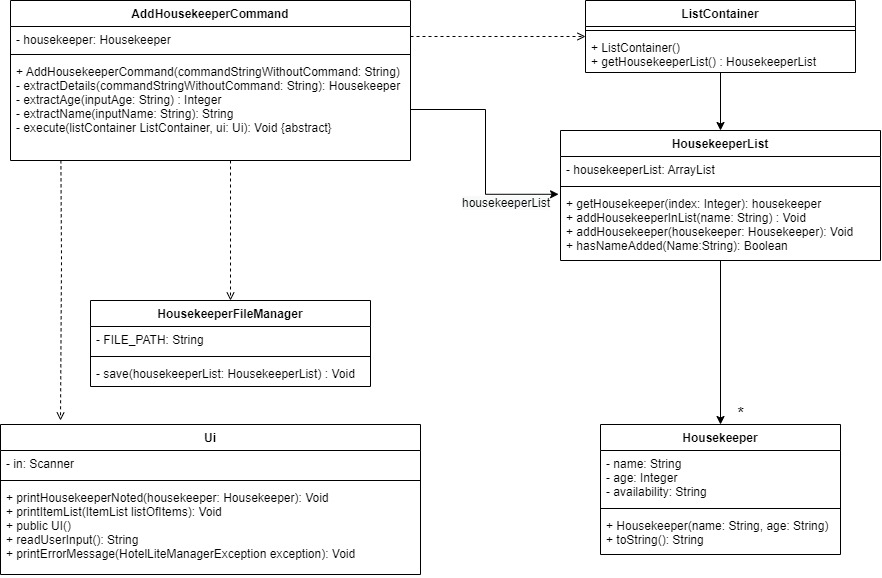
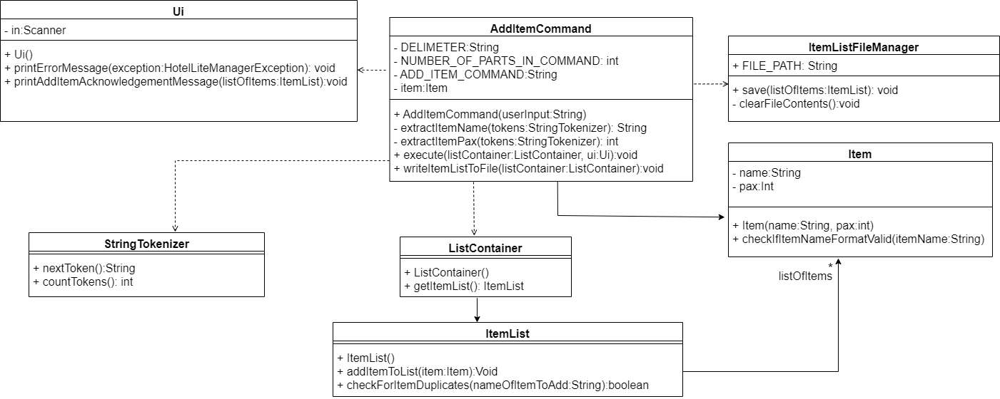
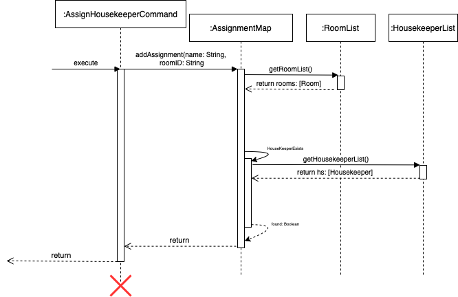
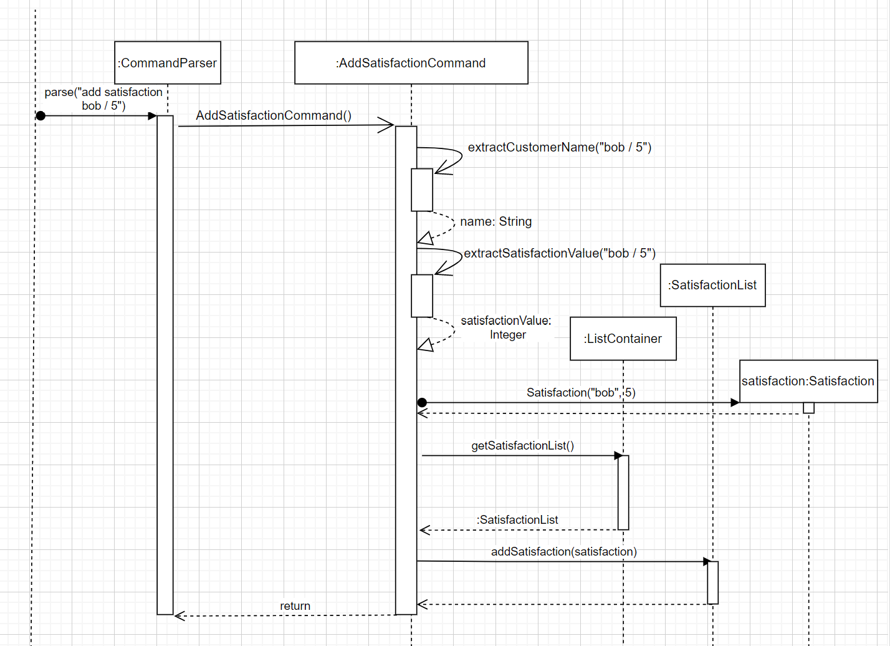
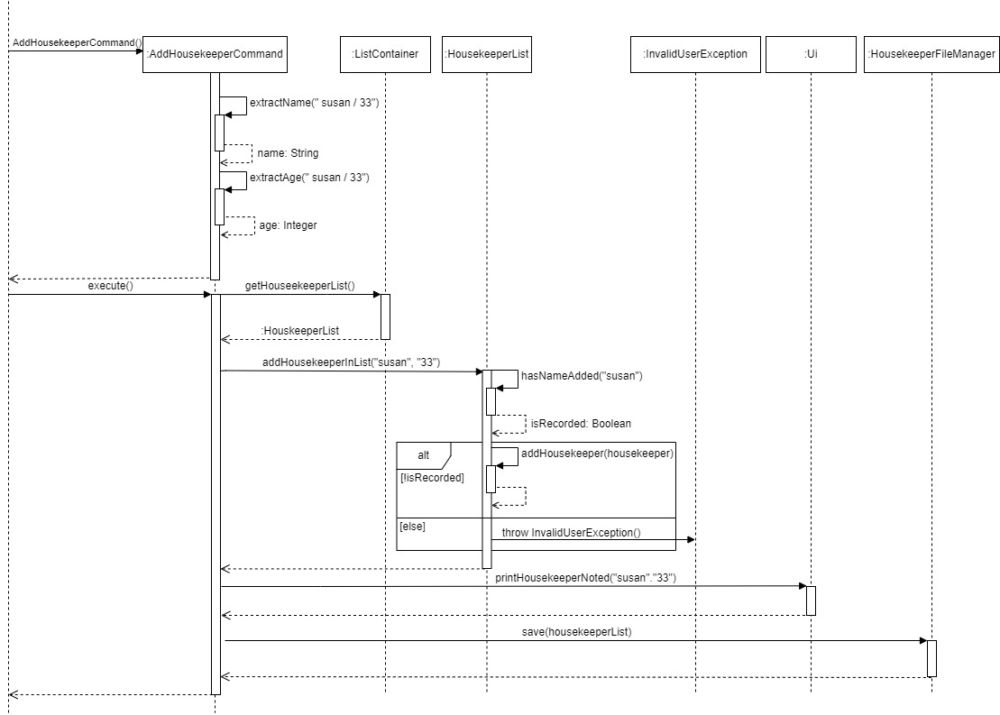
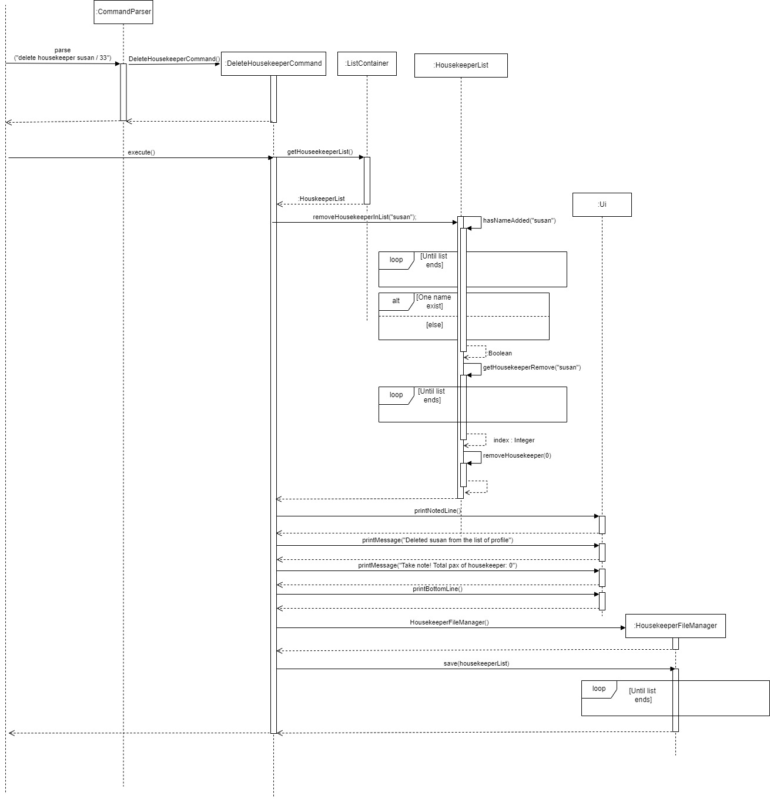
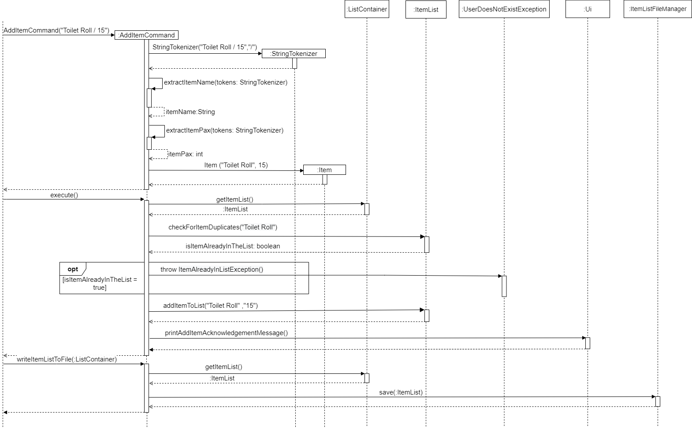

# Developer Guide

## Design & implementation

## Design

### Add Housekeeper Command

The objective of the `AddHousekeeperCommand` is to take in user input and spilt it into two parts which is the name and age of a Housekeeper. These details make up parts of the Housekeeper profile. With the name and age derived, this information will be added into a new Housekeeper object, which will be recorded into the list of housekeeper. The class diagram below depicts how the `AddHousekeeperCommand` interacts with other classes.

PLEASE NOTE: This class diagram omits the details of some classes involved, like the `Duke`, `CommandParser` and `Command` class.

Below is an example showing the usage of `AddHousekeeperCommand`.
Step 1: Command given from the user: `add housekeeper susan / 33`. This command meant to add a new housekeeper called susan who is 33 years old.

Step 2: The parse method from `CommandParser` will run parse to create `AddHousekeeperCommand` and would be return to Duke.

Step 3: The execute method in `AddHousekeeperCommand` will be performed. It would get the `housekeeperList` from `ListContainer`.

Step 4: The `addHousekeeperInList` method from `HousekeeperList` would be called to check if the housekeeper has been recorded.
name of the housekeeper to be added has been recorded into the list. 

Step 5: `addHousekeeperInList` will verify if housekeeper name is in the list by calling `hasNameAdded` and stores the 
result in boolean.
If it has not been recorded, housekeeperList would then add this new user into the records by calling `addHousekeeper`
method. 

Step 6: `printHousekeeperNoted` will be called to print a confirmation to show that the housekeeper 
has been entered into the list.

Step 7. Housekeeper file storing all profile will be updated by calling method `save` from `HousekeeperFileManager`

### Add Item Command
The objective of the AddItemCommand is to allow the user to add a new item to the list of items found within the inventory. It takes in the user input and spilt it up into two parts which are the name of the item to be added and its pax. These two information would then be used to create an Item Object and the Item Object would be saved into a list of items.

Below is the partial class diagram detailing the design of the Add Item Command Class as well as its interactions with the various other classes required to execute the Add Item Command.

Step 1: When the user enters the command `Add Item Toilet Roll / 15`, the `Duke` class would pass the user input to the `Command Parser` Class.

Step 2: The `Command Parser` Class would run the `parse` method and create an `AddItemCommand` object containing an `Item` object which is made up of the name of the item to add as well as its pax which are found within the user input.

Step 3: The `AddItemCommand` class would be passed back to the `Duke` class.

Step 4: The `execute` method of the `AddItemCommand` class would be run and the `ItemList` Object would be extracted from the `List Container` object and the `AddItemCommand` object would pass its Item object to the `ItemList` Object's `addItemToList` method.

Step 5: The `addItemToList` method would then call the `checkForItemDuplicates` method to check if there are any items within the item list with the same name as the item we are about to add.

Step 6:I f there are is an item with a matching name found, we would then call the `UI` object and execute the `UI`'s `printItemAlreadyInTheListErrorMessage` method which would print a message informing the user that the item the user wants to add is already found within the item list and hence nothing would be added. Step 7 and 8 are skipped.

Step 7: If there are no items with a matching name found, we would add the `Item` object to its ArrayList of `Item` objects called listOfItems. The `AddItemCommand` then call the `UI` and execute the `UI`'s `printAddItemAcknowledgementMessage` method which would print an acknowledgement message to the user informing him that the item has been added into the item list.

Step 8: The `ItemListFileManager` object would be called and we would pass the item list to its `writeItemListToFile` method to write the updated item list into the file ListFolder/ItemList.txt.

## Implementation

#### Assign a housekeeper to a room
The assignment of housekeeper to a room is facilitated by `AssignHousekeeperCommand`. This command objects uses `AssignmentMap`, which keeps a `HashMap`, to help us map a `Room` object to a `Housekeeper` object. 

``
Map<Room, Housekeeper> map = new HashMap<>();
``

The following steps exhibit how `AssignHousekeeperCommand` 
and `AssignmentMap` fit together in the structure and how the mechanism for adding an assinment behaves at each step.

__Step 1.__ The user launches the application. In the `Duke` class, an empty instance of the `AssignmentMap` class,
called `assignmentMap`, is created.

__Step 2.__ The user types the command `Assign Susan ## 301`. In the `Duke` class, a `Command` object
is created by invoking the `CommandParser` class's constructor on the user input. The details of this
step are further described below.

__Step 3.__ The `CommandParser` class replaces the `Assign Susan ## 301` in the user input with an empty string,
leaving just `Susan ## 301`. Then, an instance of `AssignHousekeeperCommand` is created which extends the class `Command`.

__Step 4.__ The `assignHousekeeperCommand` object parses the name of the housekeeper and the ID of the room and send both to the the `assignmentMap`.

__Step 5.__ The `assignmentMap` looks for the appropriate `Room` object for `301` in the `RoomList` and then looks for the appropriate `Housekeeper` object for `Susan`. It then adds both to the hashmap contained inside itself.

__Interaction__ To understand the interaction between objects of these classes in order to actually add an entry into the hash map inside an `AssignmentMap`, refer to the sequence diagram below.

The command object passes on the ID of the room and the name of the housekeeper to the `AssignmentMap` object after parsing the input appropriately. The `addAssignment` function first locates the appropriate `Room` object from `RoomList`, and then looks for the `Housekeeper` object in the `HousekeeperList` and finally adds the mapping to the hash map.

#### Adding a customer's satisfaction rating

The mechanism for adding a customer satisfaction (represented by the Satisfaction class) is facilitated
by `AddSatisfactionCommand`. The constructor parses user input to create a `Satisfaction` object (which contains
attributes storing the customer's name and their satisfaction rating, represented as an integer from 1 to 5).
`AddSatisfactionCommand` extends `Command` and contains an override of the `Command` class's execute method.
This execute method adds the `Satisfaction` object created from parsing user command into `satisfactionList`, the
object of type `SatisfactionList` that stores the `Satisfaction` objects. This `SatisfactionList` is 
stored in a `ListContainer` object (the object that stores references to all of the data structures
that the application uses). Additionally, it implements the following operations:
* `AddSatisfactionCommand#extractCustomerName(String userInput)`: Extracts the customer's name (a string) from the
  provided string of user input.
* `AddSatisfactionCommand#extractSatisfactionValue(String userInput)`: Extracts the customer's satisfaction rating
  (an integer from 1 to 5) from the provided string of user input.
* `AddSatisfactionCommand#getSatisfaction()`: Grabs the value of the `satisfaction` instance variable.
* `AddSatisfactionCommand#setSatisfaction(Satisfaction satisfaction)`: Sets the `satisfaction` instance variable to the
  provided `Satisfaction` object.

Given below is an example usage scenario and how the mechanism for adding a satisfaction behaves at each step.

Step 1. The user launches the application. In the `Duke` class, a `ListContainer` object is instantiated. 

Step 2. The user types the command `add satisfaction bob 5`. In the `Duke` class, a `Command` object
is created by invoking the `CommandParser` class's constructor on the user input. The details of this
step are further described below.

Step 3. The `CommandParser` class replaces the `add satisfaction` in the user input with an empty string,
leaving just `bob 5`. Then, the `AddSatisfactionCommand` class's constructor is invoked with `bob 5`.

Step 4. The `AddSatisfactionCommand` class's constructor parses `bob 5`, extracting the customer name `Bob` using the
`AddSatisfactionCommand#extractCustomerName(String userInput)` method and extracting the customer satisfaction rating
`5`using the `AddSatisfactionCommand#extractSatisfactionValue(String userInput)` method. The `AddSatisfactionCommand`
class constructor then invokes the `Satisfaction` class's constructor to create a new `Satisfaction` object, passing in
customer name `bob` and satisfaction rating `5`.

Step 5. When the `AddSatisfactionCommand` object is executed in the `Duke` class, the `satisfactionList` object is 
obtained from the `ListContainer` object. Then, the `satisfaction` is added to the `satisfactionList`. 

The following sequence diagram shows what would happen if the user typed `add satisfaction bob 5`.

PLEASE NOTE: This sequence diagram omits the details of some behavior and classes involved, like the `Duke` class.

### Add Housekeeper feature

PLEASE NOTE: This sequence diagram omits the details of some behavior and classes involved, like the `Duke` class.

The add housekeeper mechanism is facilitated by `AddHousekeeperCommand`. It extends command. Additionally, 
it implements the following operations:
* `AddHousekeeperCommand#extractName()`— Derive the name of the Housekeeper
* `AddHousekeeperCommand#extractAge()`— Derive the age of Housekeeper and cast it into an integer
* `AddHousekeeperCommand#execute()` — Executes the addition of new housekeeper into list
* `HousekeeperList#addHousekeeperInList()` — Facilitates the adding of new housekeeper into the list
* `HousekeeperList#hasNameAdded()` — Checks if name of housekeeper has been recorded
* `HousekeeperList#addHousekeeper()` — Method to add housekeeper into the list
* `Ui#printHousekeeperNoted()`  — Prints a message to show user that housekeeper has been added into the list
* `HousekeeperFileManager#save()` — Updates the new housekeeper added into housekeeper file

Given below is an example usage scenario of how AddHousekeeperCommand behaves at each step.

Step 1: User launches the application for the first time. The list of housekeeper in records is empty.

Step 2: User give an add housekeeper command `add housekeeper susan / 33`. The input will be split by the delimiter
`/` to derive `susan` and `33`. The `CommandParser` runs parse which will return a new `AddHousekeeperCommand`.

Step 3: `AddHousekeeperCommand#extractName()`and `AddHousekeeperCommand#extractAge()` will derive `susan` and `33`.

Step 4: The `AddHousekeeperCommand` will now contain `susan` and `33`.

Step 5: The execute method will derive the housekeeper name, `susan` which would first get the list of housekeeper
from `ListContainer`. It will then call the `HousekeeperList#addHousekeeperInList()`.

Step 6: `HousekeeperList#hasNameAdded()` will be called to check if housekeeper name has already been recorded in list.

If housekeeper name has been recorded, `InavlidUserException()` will be thrown. 

If housekeeper name has not been recorded `HousekeeperList#addHousekeeper()` would be called to
add the housekeeper, `susan` and `33` into the housekeeperList.

Step 7: It will then call `Ui#printHousekeeperNoted()` to notify user that housekeeper has been added into the list.

Step 8: Since a housekeeper has been added, `HousekeeperFileManager#save()` will be called to save the contents of the
`housekeeperlist` into housekeeper file.

### Delete Housekeeper feature 
The add housekeeper mechanism is facilitated by `DeleteHousekeeperCommand`. It extends command. Additionally, it 
implements the following operations:
* `DeleteHousekeeperCommand#execute()` — Executes the addition of new housekeeper into list

Given below is an example usage scenario of how DeleteHousekeeperCommand behaves at each step.

Step 1: User has already added a housekeeper called `susan`, age `33`. Sally is not keen in working as a housekeeper
anymore and resigns. User has to delete the records of `susan` form `housekeeperlist`.

Step 2: User give a delete housekeeper command `delete housekeeper susan` The input will derive the name parameter of 
the delete command which is `susan`.

Step 3:  The `DeleteHousekeeperCommand` will now contain `susan`.

Step 4: The execute method will call `HousekeeperList#removeHousekeeperInlist()`. The remove method in housekeeper list
will then call `HousekeeperList#hasNameAdded` where it would use streams to store the housekeeper name which matches
the name for the housekeeper to be deleted. Assuming `susan` exist, this method will then return true.

Step 5: Since `susan` is recorded in the list, the program can proceed to delete `susan` from `housekeeperList`. 
`HousekeeperList#getHousekeeperRemove()` will be called to derive the index of `susan` in the `housekeeperList`.
Assuming `susan` is in the front of the list, the method will return `0`. This index will then be pass to 
`HousekeeperList#removeHouseekeeper()` which removes `sally` from the list

Step 6: It will then proceed to print noted message to inform user that the deletion has been completed by calling
`Ui#printNoted()`, `Ui#printMessage()` and `Ui#printBottomLine`.

Step 7: Changes in the list will be updated to file by calling `HousekeeperFileManager#save()` method.

### Add Item Command
The add item to a list of items in the invetory mechanism is facilated by 'AddItemCommand'. It extends 'Command' and implements the following operations:
- `AddItemCommand#extractItemName` - Extracts the name of the item to add from the user input.
- `AddItemCommand#extractPax` - Extracts the pax of the item to add from the user input.
- `AddItemCommand#setItem` - Saves the item to the AddItemCommand object.
- `AddItemCommand#getItem` - Extracts the item saved within the AddItemCommand object.
- `AddItemCommand#execute` - Adds the item into the list of items.

The sequence diagram above showcases an example usage scenario of the Add Item Command and how the Add Item mechanisms behaves at each step:

Step 1: The user enters the `Add Item Toilet Roll / 15` command to add a new item which is `Toilet Roll` that has a pax of `15` into the inventory. `CommandParser#parse` is called and the user input `Add Item Toilet Roll / 15` is passed to it.

Step 2: `CommandParser#parse` would identify the user input as an Add Item Command by searching for the keyword `Add Item` within the user input. It would then remove `Add Item` from the user input causing the user input to be just `Toilet Roll / 15`. `CommandParser#parse` would then call the constructor of `AddItemCommand` and pass it `Toilet Roll / 15`.  

Step 3:  An `AddItemCommand` object would be created. The constructor of `AddItemCommand` would call `AddItemCommand#extractItemPax` and `AddItemCommand#extractItemName` respectively to extract out `15` and `Toilet Roll`. The constructor of `AddItemCommand` would then call the constructor of `Item` which would create an `Item` object containing `Toilet Roll` and `15`. The `Item` object would then be returned to the constructor of `AddItemCommand`. The `Item` object would be saved to the `AddItemCommand` object using `AddItemCommand#setItem`. The `AddItemCommand` object would be passed back to `CommandParser#parse`.   

Step 4: `CommandParser#parse` would then call `AddItemCommand#execute` which would call `AddItemCommand#getItem` to extract out the item currently saved within the `AddItemCommand` object.  

Step 5: `AddItemCommand#execute` would then call `ItemList#addItemToList` and pass it the item object.This results in the `Item` object being added into the `ItemList`.

Step 6: `AddItemCommand#execute` would then call `Ui#printAddItemAcknowledgementMessage` which would print out an acknowledgement message informing the user that the item has been succesfully added into the item list.

### check room information by level

The checking room information by level mechanism is facilitated `CheckRoomByLevelCommand`. It extends command. Additionally, it implements the following operations:
* `CheckRoomByLevelCommand#isValidLevel(int level, RoomList roomList)` - Checks if the level number is valid
* `CheckRoomByLevelCommand#printRoom(int level, RoomList roomlist)` - Prints all room information ar target level

Given below is an example usage scenario of how `CheckRoomByLevelCommand` behaves at each step.

Step 1: User launches the application for the first time. The status of all room will be vacant

Step 2: User give a command `check level 2`. The `CommandParser` runs phase which will return a new `CheckRoomByLevelCommand`.
and it will parse the parameter after replace command `check level` to ``.

Step 3: The `CheckRoomByLevelCommand` will now contain `2`.

Step 4: The `execute` method will call `isValidLevel(int level, RoomList roomList)` method to check if the level number is valid.

Step 5: The `excute` method will then call `printRoom(int level, RoomList roomList)` method to print room information at target level.

## Product scope
### Target user profile

{Describe the target user profile}

### Value proposition

{Describe the value proposition: what problem does it solve?}

## User Stories

|Version| As a ... | I want to ... | So that I can ...|
|--------|----------|---------------|------------------|
|v1.0|new user|see usage instructions|refer to them when I forget how to use the application|
|v2.0|user|find a to-do item by name|locate a to-do without having to go through the entire list|

## Non-Functional Requirements

{Give non-functional requirements}

## Glossary

* *glossary item* - Definition

## Instructions for manual testing

{Give instructions on how to do a manual product testing e.g., how to load sample data to be used for testing}

