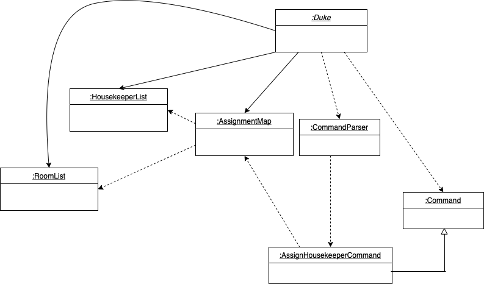

# Aiman Imtiaz - Project Portfolio Page

## Overview

I am one of the developers of Hotel Lite, a CLI application designed for hotel owners to manage their businesses efficiently.
This application offers functionalities for keeping track of hotel inventory,
managing housekeeper staff records, recording customer satisfaction ratings,
assigning housekeepers to rooms,
adding, deleting, viewing events happening in the hotel,
and maintaining the state of checked-in/checked-out rooms.

### Summary of Contributions

My code contributions to the project can be viewed as here:

[Aiman Imtiaz - Reposense](https://nus-cs2113-ay2122s2.github.io/tp-dashboard/?search=&sort=groupTitle&sortWithin=title&timeframe=commit&mergegroup=&groupSelect=groupByRepos&breakdown=true&checkedFileTypes=docs~functional-code~test-code~other&since=2022-02-18&tabOpen=true&tabType=authorship&tabAuthor=aiman-imtiaz&tabRepo=AY2122S2-CS2113-T11-1%2Ftp%5Bmaster%5D&authorshipIsMergeGroup=false&authorshipFileTypes=docs~functional-code~test-code&authorshipIsBinaryFileTypeChecked=false)

#### Event-related functionalities

I added a suite of event-related commands in the application, allowing the user to add, delete and view events happening on the hotel premises. Events can be added using `add event DESCRIPTION / DATE` command where the `DATE` has to be in the `yyyy-mm-dd` format. I used the package `LocalDate` to accommodate the date format.

Using `LocalDate` presented a challenge while implementing the `FileManager` for `EventList`, as the our string conversion command converted a date to `mmm d yyyy` format, however while parsing lines from the file, we needed it in the `yyyy-mm-dd` format again for to be added to `EventList`. Some conversions here and there were required to work around this issue.

Another challenge while using `LocalDate` was adding a check to see whether the user used the correct format for date. I created an exception which gave out the message that the date needed to be in a certain format. In order to "catch" when I can throw this exception, I used the `try.. catch` around `LocalDate.parse()`. This way if parse did not succeed, I would be able to "catch" the case and throw an internal `HotelLiteManagerException`.

This suite allows the user to do the following:
* Create a new event happening in the hotel using `add event  DESCRIPTION / DATE` format. 
* Delete an event using `delete event INDEX`
* View all added events using `list events`.

#### Link between room-related functionalities and housekeeper-related functionalities
I added a command which links the functionalities added by my teammates __Xunyi__ and __Falicia__. The command I added to assign a houskeeper to a room is in the formal `assign NAME / ROOMID`. This required quite an interplay between my teammates code and mine. Some of the examples of this interplay are provided below:
* Every time the `assign` command is called, the housekeeper list maintained by __Falicia__ is referred to see whether a housekeeper by the given name even exists.
* The `RoomList` provided by __Xunyi__ is checked to see whether the room exists at all.
* After these checks pass, the information is stored in `AssignmentMap` which contains a `HashMap` to store which room (key) is attached to which housekeeper (value). The `AssignmentMap` class also has contributions from __Xunyi__.
* Once __Falicia__'s `delete housekeeper` command is called, I also use `AssignmentMap` to make sure that the given assignment entry is deleted from the program as well.
* The `FileManager` for `AssignmentMap` saves both the `ROOMID` and the `NAME` to ensure that correct information is restored from the files once the program is reloaded.

### Review Contributions

I reviewed my teammates PRs on many occasions. Some of them are linked below:

1. [https://github.com/AY2122S2-CS2113-T11-1/tp/pull/341](https://github.com/AY2122S2-CS2113-T11-1/tp/pull/341)
2. [https://github.com/AY2122S2-CS2113-T11-1/tp/pull/337](https://github.com/AY2122S2-CS2113-T11-1/tp/pull/337)
3. [https://github.com/AY2122S2-CS2113-T11-1/tp/pull/268](https://github.com/AY2122S2-CS2113-T11-1/tp/pull/268)
4. [https://github.com/AY2122S2-CS2113-T11-1/tp/pull/265](https://github.com/AY2122S2-CS2113-T11-1/tp/pull/265)
5. [https://github.com/AY2122S2-CS2113-T11-1/tp/pull/262](https://github.com/AY2122S2-CS2113-T11-1/tp/pull/262)
6. [https://github.com/AY2122S2-CS2113-T11-1/tp/pull/254](https://github.com/AY2122S2-CS2113-T11-1/tp/pull/254)
7. [https://github.com/AY2122S2-CS2113-T11-1/tp/pull/200](https://github.com/AY2122S2-CS2113-T11-1/tp/pull/200)
8. [https://github.com/AY2122S2-CS2113-T11-1/tp/pull/199](https://github.com/AY2122S2-CS2113-T11-1/tp/pull/199)
9. [https://github.com/AY2122S2-CS2113-T11-1/tp/pull/198](https://github.com/AY2122S2-CS2113-T11-1/tp/pull/198)
10. [https://github.com/AY2122S2-CS2113-T11-1/tp/pull/195](https://github.com/AY2122S2-CS2113-T11-1/tp/pull/195)
11. [https://github.com/AY2122S2-CS2113-T11-1/tp/pull/156](https://github.com/AY2122S2-CS2113-T11-1/tp/pull/156)
12. [https://github.com/AY2122S2-CS2113-T11-1/tp/pull/140](https://github.com/AY2122S2-CS2113-T11-1/tp/pull/140)
13. [https://github.com/AY2122S2-CS2113-T11-1/tp/pull/103](https://github.com/AY2122S2-CS2113-T11-1/tp/pull/103)
14. [https://github.com/AY2122S2-CS2113-T11-1/tp/pull/98](https://github.com/AY2122S2-CS2113-T11-1/tp/pull/98)

I made sure that all PRs by my teammates were added to the correct milestone and assigned to the correct person, such that their work would be detected and recognised.

### Contributions to the Developer Guide (Extracts)

#### Assign a housekeeper to a room
The assignment of housekeeper to a room is facilitated by `AssignHousekeeperCommand`. This command objects uses `AssignmentMap`, which keeps a `HashMap`, to help us map a `Room` object to a `Housekeeper` object.

``
Map<Room, Housekeeper> map = new HashMap<>();
``

The following steps exhibit how `AssignHousekeeperCommand`
and `AssignmentMap` fit together in the structure and how the mechanism for adding an assignment behaves at each step.

__Step 1.__ The user launches the application. In the `Duke` class, an empty instance of the `AssignmentMap` class,
called `assignmentMap`, is created.

__Step 2.__ The user types the command `assign susan / 301`. In the `Duke` class, a `Command` object
is created by invoking the `CommandParser` class's constructor on the user input. The details of this
step are further described below.

__Step 3.__ The `CommandParser` class replaces the `assign susan / 301` in the user input with an empty string,
leaving just `susan / 301`. Then, an instance of `AssignHousekeeperCommand` is created which extends the class `Command`.

__Step 4.__ The `assignHousekeeperCommand` object parses the name of the housekeeper and the ID of the room and send both to the the `assignmentMap`.

__Step 5.__ The `assignmentMap` looks for the appropriate `Room` object for `301` in the `RoomList` and then looks for the appropriate `Housekeeper` object for `Susan`. It then adds both to the hashmap contained inside itself.

__Interaction__ To understand the interaction between objects of these classes in order to actually add an entry into the hash map inside an `AssignmentMap`, refer to the sequence diagram below.

The command object passes on the ID of the room and the name of the housekeeper to the `AssignmentMap` object after parsing the input appropriately. The `addAssignment` function first locates the appropriate `Room` object from `RoomList`, and then looks for the `Housekeeper` object in the `HousekeeperList` and finally adds the mapping to the hash map.

